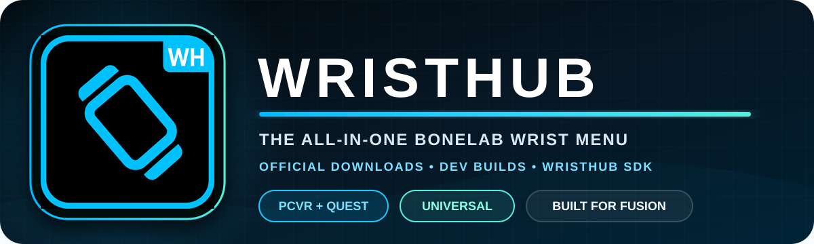

  

  
  

  
  
  
  

<h1 align="center">WristHub</h1>

  A universal all-in-one wrist menu for <strong>BONELAB</strong>, built for both <strong>PCVR</strong> and <strong>standalone Quest</strong>.
  Browse content, manage Fusion, use social tools, customize your avatar, and control your experience without leaving VR.

---

## Download WristHub

| Channel | Best for | Download |
|---|---|---|
| **Full Release** | Most players. Tested, stable, and updated less often. | **[Download the latest Full Release](https://github.com/MrAssBurgers/WristHub/releases/latest)** |
| **Dev Builds** | Beta testers who want the upcoming version and newest fixes immediately. Builds may contain unfinished features. | **[Open the Dev Builds section](https://github.com/MrAssBurgers/WristHub/releases?q=wristhub-dev)** |

> **New users should choose Full Release.** Dev Builds are for testing and can update frequently.

## What WristHub includes

| Feature | What it does |
|---|---|
| **Avatar Hub** | Browse, search, install, preview, scan, equip, and manage avatars; access stats and cosmetics from your wrist. |
| **Spawner** | Search spawnables, view textured 3D previews, use recents and favorites, scan objects, and spawn by hand, float, front, or raycast. |
| **Fusion Browser** | Browse and join Fusion lobbies, view lobby information, switch servers, and manage your current lobby. |
| **Friends** | Add players by code, nearby detection, or WristHub-to-WristHub interaction; see online friends, requests, invites, chats, and groups. |
| **Calls** | Cross-lobby voice and video calling with a movable camera, POV options, mute, volume, speaker, and hang-up controls. |
| **Party Portals** | Open visible Fusion-synced portals that other WristHub users can enter, including two-way and remote portal controls. |
| **Soundboard** | Community and custom sounds, folders, search, local monitoring, and Fusion playback on PCVR and Quest. |
| **Voicemod** | PCVR control for supported Voicemod voices, sounds, monitoring, shortcuts, and microphone controls. |
| **Abilities** | Configurable ESP, phase, teleportation, fullbright, strength, health, jump, agility, density, finger guns, and shortcuts. |
| **Utilities** | Useful wrist tools, cosmetics and holster controls, display options, ray interaction, performance controls, and diagnostics. |
| **Themes** | Multiple visual styles, including the MrAssBurgers Edition, plus watch and interface customization. |
| **Automatic Updates** | Signed release channels for Full Release and Dev Builds with verified downloads and automatic fallback. |
| **Log Center** | Version-aware WristHub diagnostics that help identify PCVR and Quest problems without duplicate error spam. |

Some features depend on the installed platform, BONELAB/Fusion version, network availability, and required dependencies.

## Universal build

There is only **one WristHub package**. It detects whether the player is using PCVR or Quest and loads the correct platform support automatically.

- No separate PCVR package
- No separate Quest package
- One version number
- One update channel selection
- One download for everybody

## Installation

1. Open **[Full Release](https://github.com/MrAssBurgers/WristHub/releases/latest)** or **[Dev Builds](https://github.com/MrAssBurgers/WristHub/releases?q=wristhub-dev)**.
2. Expand the release's **Assets** section.
3. Download the WristHub ZIP.
4. Install it using the folder layout included in the package and the normal BONELAB code-mod installation process.
5. Launch BONELAB and confirm that **WristHub Updater is online** during startup.

Keep WristHub and its required BONELAB/Fusion dependencies current.

## Update channels

Open **WristHub → Settings → Updates** in game:

- **Full Release** keeps you on the recommended public version.
- **Dev Builds** opts you into the newest upcoming build whenever one is published.

Full Release is the safe default. Changing to Dev Builds means you are volunteering to test work in progress.

## Safe automatic updates

WristHub downloads through this GitHub repository first, then uses the signed WristHub service as a fallback. Every archive must match its signed file size and SHA-256 hash before installation, so a failed or incomplete mirror cannot silently install.

## Repository purpose

This is WristHub's official public download and update repository. Releases are mirrored automatically so PCVR and Quest users receive the same verified package while keeping update delivery fast and inexpensive.

  Made with care for the BONELAB community by <strong>MrAssBurgers</strong>.

